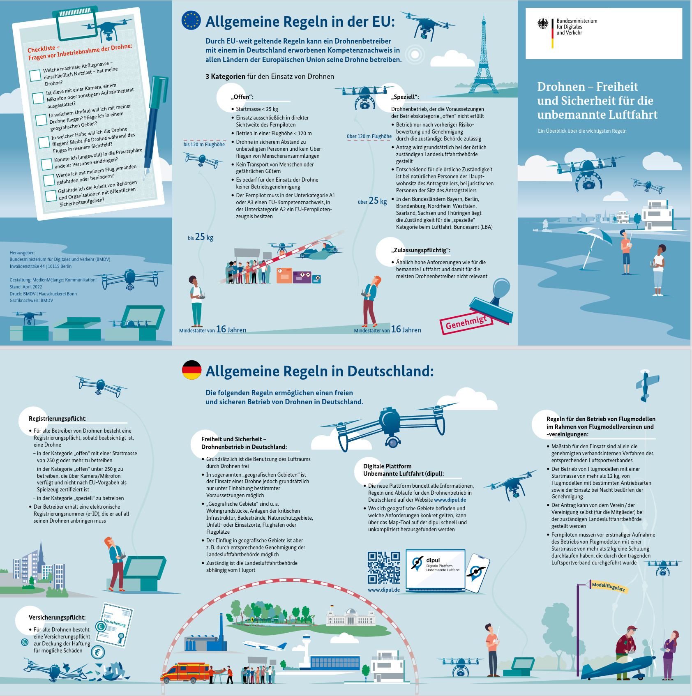

# General regulations - German Drone Regulation from July 2021 [ LuftVO §21h ]

Following the new [EU Drone Regulation 2021](https://www.easa.europa.eu/domains/civil-drones) (2019/947 and 2019/945), Germany now also adopts the EU requirements and implements them into German law (Luftverkehrs-Ordnung (LuftVO)). This means for all drone pilots and UAS operators changes after the introduction of the EU Drone Regulation 2021 which are given in [LuftVO §21h](https://www.gesetze-im-internet.de/luftvo_2015/__21h.html). 

You will find the most important rules (German only) in the below [cheat sheet](https://www.bmvi.de/SharedDocs/DE/Anlage/LF/drohnen-flyer-regelungen-eu-und-deutschland.pdf?__blob=publicationFile) of the Bundesministerium für Digitales und Verkehr.

Since there is no English version of the cheat sheet, the following text lists the above rules that are relevant for the course framework. 



 
## Registration operator of the UAV

Registration of the drone operator is required within the EU in the respective country. In Germany, this registration is done online at the [Luftfahrtbundesamt](https://uas-registration.lba-openuav.de/#/registration/uasOperator) (LBA).  Additional registration of the drone itself is not required.  The eID (UAS operator ID) assigned during registration must be visibly attached to each owned drone.

## Liability insurance

For almost all UAVs there is an insurance obligation for a drone liability insurance.

## Specific regulations UAVs < 250 g (DJI Mavic Mini 2) 

The UAVs less than 250 grams is operated in the [EU OPEN A1](https://www.easa.europa.eu/domains/civil-drones/drones-regulatory-framework-background/open-category-civil-drones) category, therefore no EU drone license is required. In addition is allowed to fly in the vicinity of people (30m) and highly relevant - even uninvolved persons. No crowds/gatherings of people are allowed to be flown over, if unexpectedly uninvolved persons should be flown over, this overflight must be terminated as soon as possible.

## Distance to airfields and airports

 * a lateral (to the fence) distance of 1 kilometer applies to commercial airports. In the extension of the runway - in the flight corridor each 5 kilometers distance in length and 2 kilometers in width in to each runway.
* a general buffer of 1.5 kilometers applies to airfields, starting at the fence of the airfield.
* Helipads and heliports are without rule Usually helipads are treated equivalent to airfields i.e. 1.5 km buffer.

**Exception permit:**
* for airports, an exception permit must be applied for at the responsible state aviation authority
* for airfields and heliports a simple clearance from the air traffic control is sufficient

## Residential areas/residential properties 

Residential areas and residential property may be overflown at an altitude of between 100 and 120 meters if:

* an overflight is absolutely necessary and cannot be conducted over public areas (e.g. roads) 
* *and* a justified interest exists 
* *and* obtaining permission from local residents is unreasonable
* *and* the flight takes place between 6:00 a.m. - 10:00 p.m.
* *and* there is no increased noise nuisance
* *and* privacy is maintained
* *and* the residents have been informed (as far as possible).

**Exception permits:**
* For an exception to the above regulations, an exception permit must still be applied for from the relevant state aviation authority.

## Distance to traffic routes

The minimum distance of 100 meters may be undercut if:

* a minimum distance of 10 meters is always maintained **and** the 1:1 rule is applied (lateral distance >= AGL)
* shipping lanes/federal waterways may be flown over quickly at an altitude of between 100-120 meters if there are no ships or locks/facilities etc. in the vicinity.

**Exception permits:**
* Exception permits must be applied for from the operator of the respective traffic routes.

## Nature reserves

Nature reserves may be flown over:  

* if the drone flies exclusively at an altitude of between 100 to 120 meters
* for a legitimate interest and with a commercial background 
* the protective concept of the nature reserve is known and respected and
* the overflight must be necessary for the purpose of operation.

**Exception permits:**
* Exemption permits can be issued by the competent aviation authority, but or the nature conservation authority.
 
## Flying over swimming bands, outdoor swimming pools and beaches.

* Over swimming bands, outdoor pools and beaches may be flown with a drone only outside the opening hours and operating times. 

## Other distances for drones

100 meters lateral distance to the boundary to:

* Accident scenes and operation sites, industrial facilities, prisons, military facilities and organizations, facilities for centralized power generation and distribution, police/constitutional bodies, military and maneuvers and hospitals

