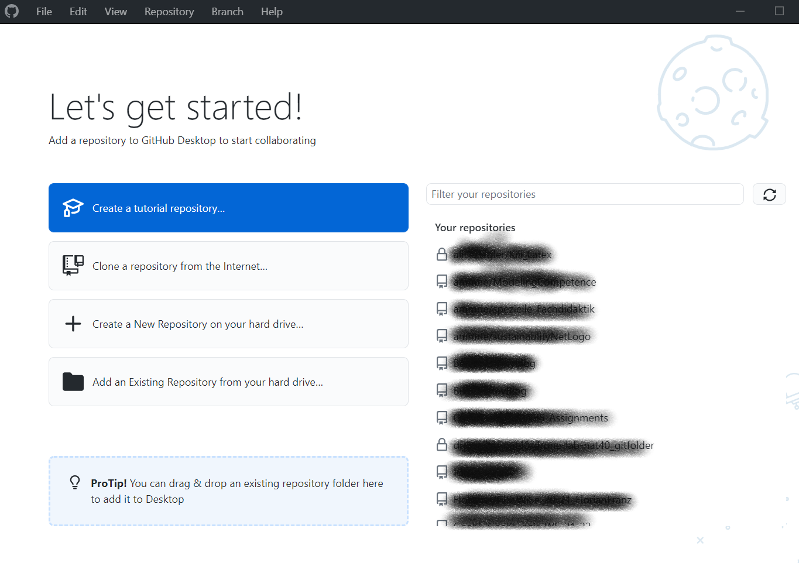

GitHub - Repositories, Forks and Pull Request. A very effective way to deal with digital content in a collaborative way in the cloud

## First things first

The interaction with `GitHub` is based on the locally installed 
Version control software `git`. This is actually quite complex, but basically in almost all cases you tell `git` to monitor certain directories and every time it is desired to create a snapshot i.e. a backup version.
 
GitHub is the cloud service to store these local directories or projects as so-called "repositories". That's it.

GitHub is preferably for text and images. So you need a text editor. You can choose any text editor you like, but if you also want to take advantage of support for R and Python, it is strongly recommended to use [`Rstudio`] (https://www.rstudio.com/products/rstudio/download/#download) and also install it now. However, for the submissions in this course, you can also use `.docx` documents. 

If you are using Windows, you can install git and GitHub Desktop together using the [GitHub Desktop installer](https://desktop.github.com/). Just run it with the default settings. During the installation process, you will be asked if you want to log in (if you already have an account) or create a new account. Please choose the accordingly and proceed. 

However, if you want to log in manually, go to the [registration form](https://github.com/signup?ref_cta=Sign+up&ref_loc=header+logged+out&ref_page=%2F&source=header-home) and log in. 

During the installation, you need to allow GitHub Desktop to manage your GitHub Cloud repos. So please follow the instructions and grant the suggested permissions. At the end, you can change your email settings, etc. It is recommended to leave them as default.

You will end with something looking like the following:

Then, to warm up, run the `Create Tutorial Repository`. It will teach you all the essentials dealing with git and GitHub

## Avanced GitHub Issues and Pull Requests

You can find more tutorial at [https://docs.github.com/en/desktop](https://docs.github.com/en/desktop).  Of particular importance is the tutorial [Creating an issue or pull request](https://docs.github.com/en/desktop/contributing-and-collaborating-using-github-desktop/working-with-your-remote-repository-on-github-or-github-enterprise/creating-an-issue-or-pull-request). This is the basis for GitHub-supported collaboration and the ability to add your submissions to an existing repository. Please work through it. 

