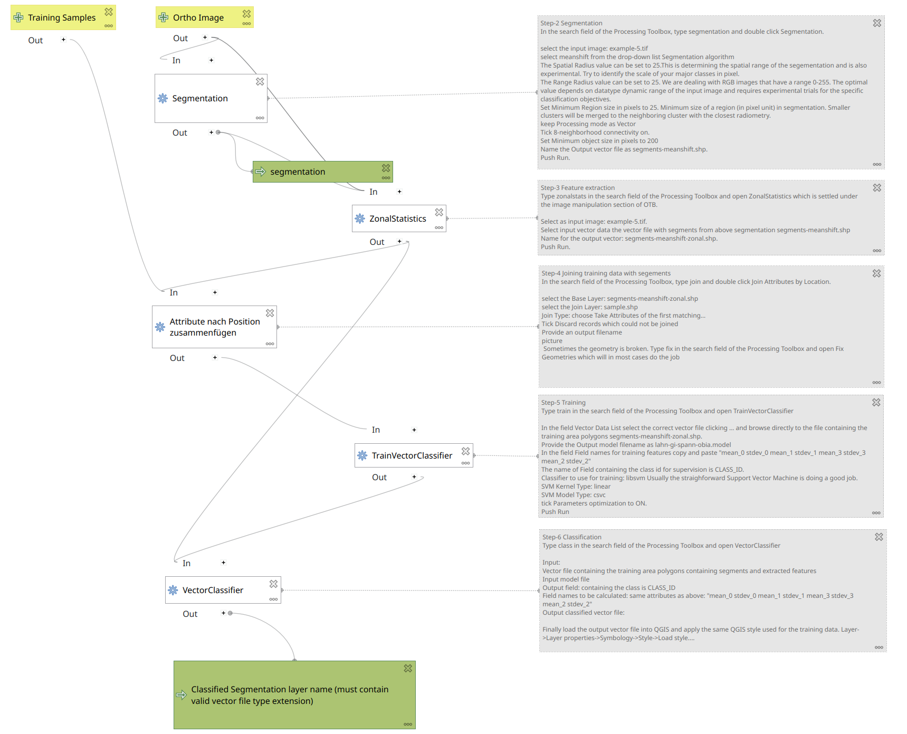

# Object-based Image Analysis (OBIA)

Human visual perception almost always outperforms computer image processing algorithms. For example, your brain easily recognizes a river, whereas a computer may struggle to distinguish rivers from lakes, roads, or sewage treatment plants.

With UAV image data — which often have high spatial resolution but minimal spectral resolution — a shift in analytical thinking is required. Instead of classifying individual pixels, it is more effective to identify meaningful **objects** or **entities**. The core principle of Object-Based Image Analysis (OBIA) is therefore: **segment first, then classify**.

Segmentation is algorithm-dependent and iteratively searches for similarities in spatial, structural, and spectral dimensions to group neighboring pixels into coherent objects. These segments are subsequently classified using supervised training data.

---

# General Workflow

The example below illustrates a typical OBIA classification procedure performed manually in a software environment. The main steps are:

1. Data acquisition (orthophoto, training data)
2. Generation of spatial segments
3. Extraction of suitable descriptive features
4. Model training
5. Classification of the input dataset

In practice, additional steps are often required due to software constraints. Furthermore, the workflow may not be strictly linear, as intermediate results are frequently reused. The following figure shows the step-by-step process in the form of a graphical model. This can be integrated into QGIS as a tool in the Processing Toolbox.

*OBIA Classification Workflow for Orthoimages*

For reference, you may <a href="obia.zip">Download</a> the base dataset. Additionally, you can download the <a href="obia1.model3">OBIA workflow</a> as a `QGIS Model`. To add it to your QGIS project, click the first icon "Models"  in the Processing Toolbox and choose `Add Model to Toolbox`. Note that it runs with fixed default values; to modify it, right-click on the model and choose `Edit Model`.

{% include kim.html content="
It is strongly recommended to save the project beforehand (e.g. as `obia_test`) to ensure consistent relative paths and avoid path resolution issues later on.
However, OTB does not respect QGIS temporary layers.
In this model, temporary files are stored in the user home directory (~), even if a project is saved.
 
🛠️ Best practice:
 
- Manually delete intermediate files (segmentation.shp, zonal.shp, etc.) before each run.
 
- Never rely on “Save to temporary file”.
 
- Unexpected gaps or missing attributes usually stem from outdated or orphaned temp files.
"%}

---

# Step-by-Step Tutorial

This step-by-step guide demonstrates an OBIA approach using QGIS and the OTB Toolbox. Many segmentation algorithms and classification methods are available. The **Mean-Shift** segmentation combined with **Support Vector Machine (SVM)** classification is robust and commonly used.

Key parameters like `Range Radius` (feature space) and `Spatial Radius` (search space), as well as the `Minimum Region Size`, significantly impact the result and often require empirical fine-tuning.

---

## Step 1 – Create Training Sample Points (Manual Digitizing)

If you're unfamiliar with digitizing in QGIS, follow this [tutorial](https://geomoer.github.io/geoAI//unit02/unit02-03_digitize_training_areas.html).  
Note: For this example, we will digitize **points**, not polygons.



Create a point vector file and digitize the following classes:

| class               | CLASS_ID |
|---------------------|---------:|
| water               |        1 |
| meadows             |        2 |
| meadows-rich        |        3 |
| bare-soil-dry       |        4 |
| crop                |        5 |
| green-trees-shrubs  |        6 |
| dead-wood           |        7 |
| other               |        8 |

Provide at least **10 widely distributed sampling points** per class.  
Save the file as `sample.gpgk`.



---

## Step 2 – Segmentation

In the QGIS **Processing Toolbox**, type *segmentation* and double-click `Segmentation`.

Configure the parameters:

- **Input image**: `example-5.tif`
- **Segmentation algorithm**: `meanshift`
- **Spatial Radius**: `25` (adjust based on the pixel scale of your major classes)
- **Range Radius**: `25` (based on image type and spectral dynamic)
- **Minimum Region size**: `25` pixels (small clusters are merged)
- **Processing mode**: `Vector`
- **Neighborhood**: tick `8-neighborhood connectivity`
- **Minimum object size**: `200` pixels
- **Output vector file**: `segments-meanshift.shp`

Click `Run`.

 

 

**Inspect results**:

- Load `segments-meanshift.shp` into your QGIS project and overlay it on `example-5.tif`
- Style the segments for visibility:  
  `Layer Properties → Symbology → Simple Fill`:  
  Set `Fill Style: No Brush` and `Stroke Color: White`
- If the result is unsatisfactory, adjust parameters and repeat.

---

## Step 3 – Feature Extraction

In the **Processing Toolbox**, type `zonalstats` and open `ZonalStatistics` (under OTB → Image Manipulation).

- **Input image**: `example-5.tif`
- **Input vector**: `segments-meanshift.shp`
- **Output vector**: `segments-meanshift-zonal.shp`

Click `Run`.

 

 

---

## Step 4 – Join Training Data with Segments

In the **Processing Toolbox**, search for *join* and open `Join Attributes by Location`.

Set the parameters:

- **Base Layer**: `segments-meanshift-zonal.shp`
- **Join Layer**: `sample.shp`
- **Join Type**: `Take Attributes of the first matching feature`
- **Tick**: `Discard records which could not be joined`
- **Output**: choose a file name

 

 



---

## Step 5 – Training

In the **Processing Toolbox**, type `train` and open `TrainVectorClassifier`.

Configure:

- **Vector Data List**: `segments-meanshift-zonal.shp` (after join!)
- **Output model filename**: `lahn-gi-spann-obia.model`
- **Field names for training features**:  
  `"mean_0 stdev_0 mean_1 stdev_1 mean_3 stdev_3 mean_2 stdev_2"`
- **Class field**: `CLASS_ID`
- **Classifier**: `libsvm`
- **SVM Kernel Type**: `linear`
- **SVM Model Type**: `csvc`
- **Parameter Optimization**: ON

Click `Run`.

 

 

---

## Step 6 – Classification

In the **Processing Toolbox**, type `class` and open `VectorClassifier`.

Configure:

- **Input Vector**: `segments-meanshift-zonal.shp`
- **Input Model**: `lahn-gi-spann-obia.model`
- **Class field**: `CLASS_ID`
- **Feature fields**:  
  `"mean_0 stdev_0 mean_1 stdev_1 mean_3 stdev_3 mean_2 stdev_2"`
- **Output vector**: `lahn-gi-spann-classified_obia.shp`

Click `Run`.

Finally, load the output vector into QGIS and apply a style:

`Layer → Properties → Symbology → Style → Load Style...`

 

 

---

# Result

You should now see a mostly well-classified result. However, expect **some misclassifications** as well.

Questions for further reflection:

- What could be the causes of the misclassifications?
- What are the weaknesses of this approach?
- How could the results be improved?

---
